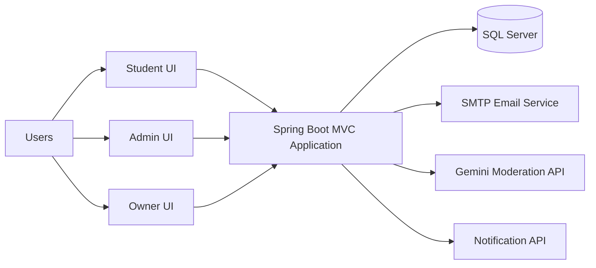

<div align="center">

# Student Concern Management System (SCMS)

Role-based concern management platform for Akademy of Knowledge Bridge.

<p>
	
	
	
	
	
</p>

</div>

## What This Project Does
SCMS helps students submit concerns, track progress, receive admin replies, and share feedback. It also includes:
- a moderated community space for students
- admin dashboards for concern handling
- owner dashboards for analytics, reports, and admin account management
- notification APIs for student alerts and broadcasts

## Contents
- [Feature Snapshot](#feature-snapshot)
- [Architecture At A Glance](#architecture-at-a-glance)
- [Tech Stack](#tech-stack)
- [Project Structure](#project-structure)
- [Quick Start](#quick-start)
- [Configuration Checklist](#configuration-checklist)
- [Role Workflows](#role-workflows)
- [Route Quick Map](#route-quick-map)
- [Database Model](#database-model)
- [AI Moderation](#ai-moderation)
- [UX Extras](#ux-extras)
- [Security Notes](#security-notes)
- [Run Tests](#run-tests)

## Feature Snapshot
| Role | Core Capabilities |
| --- | --- |
| Student | Registration + email OTP, login, concern submission with evidence, feedback lifecycle, profile management, community posting/replies, notification center |
| Admin | Concern dashboard filters, reply handling, status/category updates, student review approvals, community moderation, feedback insights |
| Owner | Admin account lifecycle management, analytics report generation/refresh, KPI APIs, broadcast notifications |

## Architecture At A Glance


## Tech Stack
- Java 21
- Spring Boot 4.0.2
- Spring MVC + Thymeleaf
- Spring Data JPA (Hibernate)
- Microsoft SQL Server driver: mssql-jdbc
- Spring Mail (SMTP)
- Spring Security Crypto (BCryptPasswordEncoder)
- TensorFlow Core Platform dependency: org.tensorflow:tensorflow-core-platform:0.5.0
- Google Gemini API integration for moderation
- Maven build system

## Project Structure
```text
.
├── pom.xml
├── SCMS SQL.sql
├── src
│   ├── main
│   │   ├── java/Project/_6/demo
│   │   │   ├── controller
│   │   │   ├── service
│   │   │   ├── repository
│   │   │   ├── entity
│   │   │   ├── dto
│   │   │   └── config
│   │   └── resources
│   │       ├── application.properties
│   │       ├── templates
│   │       └── static
│   │           ├── CSS
│   │           ├── js
│   │           └── images
│   └── test
└── remove_notif.py
```

## Quick Start

### 1) Prerequisites
- Java 21
- Maven (or Maven Wrapper)
- Microsoft SQL Server
- SMTP credentials for email
- Gemini API key (recommended for full moderation behavior)

### 2) Database Setup
1. Create a dedicated database in SQL Server.
2. Run [SCMS SQL.sql](SCMS%20SQL.sql).
3. Ensure the configured DB user has schema read/write permission.

Note: On startup, a CommandLineRunner ensures Feedback.ReplyID_FK exists.

### 3) Configure App Settings
Update [src/main/resources/application.properties](src/main/resources/application.properties):
- datasource URL/user/password
- mail host/user/password
- gemini API key/model
- server port

### 4) Build And Run
```bash
./mvnw clean package
./mvnw spring-boot:run
```

Or:
```bash
mvn clean package
mvn spring-boot:run
```

App URL: http://localhost:9090/

## Configuration Checklist

Current runtime behavior includes:
- server port 9090
- session timeout 24 hours
- max upload size 10MB
- upload static handler /uploads/** mapped to file:uploads/

Recommended secret pattern:
```properties
spring.datasource.password=${DB_PASSWORD}
spring.mail.password=${MAIL_APP_PASSWORD}
gemini.api.key=${GEMINI_API_KEY}
```

## Role Workflows

### Student Flow
Register -> Verify email -> Wait for admin approval -> Login -> Submit concern -> Track concern status/replies -> Submit feedback.

### Admin Flow
Login -> Dashboard filtering -> Open concern -> Reply/update status/category -> Moderate community -> Review feedback.

### Owner Flow
Login -> Dashboard -> Create/manage admins -> Generate or refresh reports -> Send broadcast notifications.

## Route Quick Map

<details>
<summary>Public Routes</summary>

- GET /
- GET /login
- GET /register
- POST /register/send-code
- POST /register/verify-code
- POST /register
- GET /forgot-password
- POST /forgot-password/send-code
- POST /forgot-password/verify-code
- POST /forgot-password/reset

</details>

<details>
<summary>Student Routes</summary>

- GET /student/dashboard
- GET /submit-concern
- POST /submit-concern
- GET /student/concern-history
- POST /student/feedback
- POST /student/feedback/update
- POST /student/feedback/delete
- GET /student/profile
- POST /student/profile/update
- POST /student/profile/change-password
- GET /student/community
- POST /student/community/posts
- POST /student/community/posts/{postId}/replies
- POST /student/community/moderate

</details>

<details>
<summary>Admin Routes</summary>

- GET /admin/dashboard
- GET /admin/edu-dashboard
- GET /admin/feedback
- GET /admin/concern/{id}
- POST /admin/concern/{id}/reply
- POST /admin/concern/{id}/status
- POST /admin/concern/{id}/category
- GET /admin/community
- POST /admin/community/moderate
- GET /admin/student-review

</details>

<details>
<summary>Owner Routes</summary>

- GET /owner/dashboard
- GET /owner/admin/create-page
- GET /owner/admin/manage
- POST /owner/admin/create
- POST /owner/report/create
- GET /owner/api/concerns/count
- GET /owner/api/resolution-time
- GET /owner/api/admins
- GET /owner/api/sentiment
- POST /owner/api/report/refresh/{id}
- POST /owner/api/reports/refresh-all
- GET /owner/notifications
- POST /owner/notifications/send

</details>

<details>
<summary>Notification API</summary>

- GET /api/notifications
- GET /api/notifications/unread-count
- POST /api/notifications/{id}/read
- POST /api/notifications/mark-all-read

</details>

## Database Model
Main tables:
- User
- Student
- Admin
- Concern
- Admin_reply
- Feedback
- Notification
- Analytics_Report
- Student_Community_Post
- Student_Community_Reply
- Student_Community_Rules_Acceptance
- Student_Community_Moderation_Log

High-level relationships:
- User is the base account entity
- Student and Admin are linked through UserID
- Concern links to Student and optional Admin
- Feedback links to Concern and latest Admin reply context
- Community post/reply entries link to students, with admin-name support for moderator replies

## AI Moderation
Moderation follows a layered flow:
1. Local checks (PII patterns, blocked words, language rules)
2. Gemini moderation with fallback model/version strategy
3. Moderation logging in Student_Community_Moderation_Log

Live moderation is integrated into community forms for typing-time feedback.

## UX Extras
- Guided student tour: [src/main/resources/static/js/student-tour.js](src/main/resources/static/js/student-tour.js)
- Guided admin tour: [src/main/resources/static/js/admin-tour.js](src/main/resources/static/js/admin-tour.js)
- Utility script: [remove_notif.py](remove_notif.py)

## Security Notes
Current repository settings include sensitive values in [src/main/resources/application.properties](src/main/resources/application.properties).

Before sharing or production deployment:
- Rotate all exposed secrets
- Move secrets to environment variables
- Use a dedicated non-system database
- Enable HTTPS
- Add request rate limiting on auth/moderation paths
- Validate upload MIME types server-side
- Reduce long session timeout for production

Important: owner login values are currently hardcoded in controller logic. Replace with secure credential management.

## Run Tests
```bash
./mvnw test
```

or

```bash
mvn test
```

